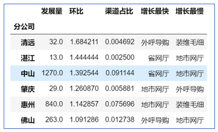

## 数据处理与分析

- [第一节：数据汇总处理](#title1)
- [第二节：发展渠道(阵地)分析](#第二节：发展渠道(阵地)分析)
- [第三节：数据可视化](#第三节：数据可视化)
- [第四节：时间函数(待更新)](#第四节：时间函数)
- [第五节：细节处理(待更新)](#第五节：细节处理)

### 第一节：数据汇总处理

###　title1

##### 热身：数据源及结果

数据源：1.0430.txt    2.0520.txt


得到的结果：21个地市的发展量、环比、渠道占比报表

发展量=指标值的和，不特殊指明时指电子渠道的发展量；$$环比=\frac{当月发展量}{上月发展量}-1$$；$$渠道占比=\frac{电子渠道当月发展量}{全渠道当月发展量}$$


##### **1、导入数据**

使用pd.read_table()，注意encoding='GBK'

##### **2、计算中间变量**

当月全渠道发展量、当月电渠发展量、上月电渠发展量

##### **3、计算环比、占比**

$$环比=\frac{当月发展量}{上月发展量}-1$$；$$渠道占比=\frac{电子渠道当月发展量}{全渠道当月发展量}$$

##### **4、合并各字段、地市排序**

使用pd.concat()合并字段、reindex进行地市排序


### 第二节：发展渠道(阵地)分析

##### **1、导入阵地对应表**

对应表文件"zddyb.csv"


##### **2、匹配对应表**

根据字段"销售渠道"、"渠道明细"，使用pd.merge()把对应表中的"阵地"字段匹配到数据源上

##### **3、分析阵地发展情况**

- 4月、5月全省电子渠道阵地发展情况

电子渠道数据，按照"阵地"进行汇总


- 4月、5月各地市电子渠道阵地发展情况

1. 先分别计算出4月、5月各地市各阵地的入网量
2. 求出5月各地市各阵地环比4月的增长量
3. 求出各地市增长最快的阵地



### 第三节：数据可视化

- [matplotlib简易教程](http://nbviewer.jupyter.org/github/py-bin/ipynb_share/blob/master/matplotlib_study/common_graphics.ipynb) ，推荐使用matplotlib画图
- 使用pandas内置画图函数

pandas内置的画图函数，其实是在matplotlib基础上包了一层，在可用于简单快速的作图。语法：

```python
DataFrame.plot(kind='line',title=None)#kind是图表类型、title是图表标题
```

| kind值  | 图表类型       |
| ------- | -------------- |
| line    | 折线图（默认） |
| bar     | 柱形图         |
| barh    | 横向柱形图     |
| hist    | 直方图         |
| box     | 箱形图         |
| kde     | 核密度估计图   |
| pie     | pie plot       |
| scatter | 散点图         |

详细语法可见[官方文档](http://pandas.pydata.org/pandas-docs/stable/generated/pandas.DataFrame.plot.html)

注意，作图时在开头添加以下三行代码，用于正常显示中文以及负号

```
matplotlib.rcParams['font.sans-serif'] = ['KaiTi']#作图的中文
matplotlib.rcParams['font.serif'] = ['KaiTi']#作图的中文
plt.rcParams['axes.unicode_minus'] = False#正常显示负号
```

宽带数据作图，

1. 本月、上月的全省发展量对比
2. 本月发展量前五地市的本月、上月发展量对比
3. 各阵地发本月、上月展量
4. 本月分天入网量走势图

### 第四节：时间函数


### 第五节：细节处理